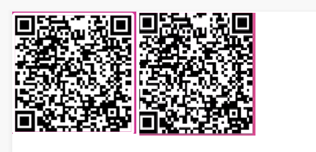
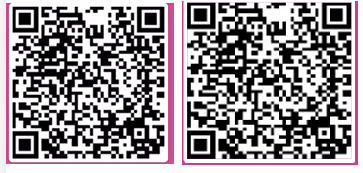

## 前端生成二维码

> 需求说明：前端生成二维码且二维码套上边框，然后这个二维码可以上下左右中间定位（乍一看是个很简单的需求，工具一套，样式一调，**边框一加 o 了**）

> 出现的问题：移动端兼容，发现在华为手机中出现了二维码大小超过边界

> 解决措施：

1. 项目中使用的是**qrcodejs2**前端生成二维码插件，使用方法
   ```javascript
   let qrcode = new QRCode(this.$refs.qrCodeUrl, {
     text: "https://juejin.cn/post/7077196404422246430", // 需要转换为二维码的内容
     width: 100,
     height: 100,
     colorDark: "#000000",
     colorLight: "#ffffff",
     correctLevel: QRCode.CorrectLevel.H,
   });
   ```
2. 如下图所示，左边 pc 端显示，右边移动端真机显示（ios 正常），移动端上面不存在边框，被吃掉了。这里我采用的是/deep/ 的形式对样式进行穿透，但是很明显不起作用。
   
   ```css
   /deep/ img {
     border: 5px solid #fff;
     border-radius: 5px;
   }
   ::v-deep img {
     border: 5px solid #fff;
     border-radius: 5px;
   }
   // >>> 只作用于css
   // >>> img {
   //   border: 5px solid #fff;
   //   border-radius: 5px;
   // }
   ```
3. 再看看**qrcodejs2**中的代码，通过生成的 html 结构我们可以看出，主要是通过生成的**canvas**，然后在调用**canvas**中的方法，将**canvas**转化成**base64**，然后通过**dom**插入的形式实现，那我为什么不直接将生成的**base64**，赋值给一个现成的img呢？外面套一层div，再到具体的样式那里，可能又会出现各种各样的问题（这里我也尝试过直接将生成的**base64**转化为**div**的**background**，但是出现的问题就是，背景超出边框了）
   ```html
   <div data-v-44ef60e7="" alt="扫描二维码" class="qrcode" title="https://juejin.cn/post/7077196404422246430">
       <canvas width="100" height="100" style="display: none;"><canvas>
       
    </div>
   ```
   ```javascript
      // qrcodejs2 287行
      function _onMakeImage() {
        this._elImage.src = this._elCanvas.toDataURL("image/png");
        this._elImage.style.display = "block";
        this._elCanvas.style.display = "none";
      }
   ```
4. 于是我尝试将生成的base64赋给一个img的src，神奇的是移动端二维码直接不出来了，那大概就是啥版本问题了
    ```javascript
   let qrcode = new QRCode(this.$refs.qrCodeUrl, {
        text: "https://juejin.cn/post/7077196404422246430", // 需要转换为二维码的内容
        width: 100,
        height: 100,
        colorDark: "#000000",
        colorLight: "#ffffff",
        correctLevel: QRCode.CorrectLevel.H,
        imgEl: this.$refs.imgCode //这里传入希望赋值的img标签
   });
   // qrcodejs2 286
   	function _onMakeImage() {
		this._elImage.src = this._elCanvas.toDataURL("image/png");
		this._elImage.style.display = "none";
		this._elCanvas.style.display = "none";
		this._htOption.imgEl.src = this._elCanvas.toDataURL("image/png");
		this._htOption.imgEl.style.display = "block";
	}
    // 调用的时候发现 _getAndroid 这个方法只能拿10之内的浮点数，而我的安卓版本刚好是10，哈哈 拿不到
	 function _getAndroid() {
		 var android = false;
		 var sAgent = navigator.userAgent;
		 // alert(navigator.userAgent)
		 if (/android/i.test(sAgent)) { // android
			 android = true;
			 var aMat = sAgent.toString().match(/android ([0-9]{1,2}\.[0-9])/i) || sAgent.toString().match(/android ([0-9]{1,2})/i);
			 
			 if (aMat && aMat[1]) {
				 android = parseFloat(aMat[1]);
			 }
		 }
		 return android;
	 }
   ```
4. 最终效果，两端一致了 
