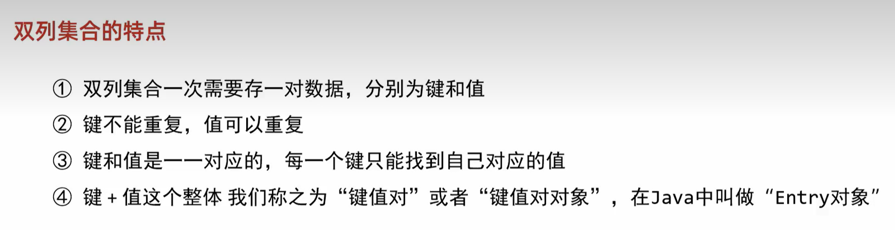

### 各种数据结构的特点和作用是什么样的

### 二叉查找树
- 跪着小的存左边、大的存右边、一样不存
- 插入的时候先跟根节点比较

### 二叉树的便利方式
- 前序遍历 当前节点 左子节点 右子节点
- 中序遍历 左子节点 当前节点 右子节点
- 后序遍历 左子节点 右子节点 当前节点
- 层序遍历 一层一层遍历

### 二叉树弊端 ：存在单链的情况

### 平衡二叉树
- 规则: 任意节点左右子树高度差不超过1
- 左旋: 以不平衡的节点开始,不断往父节点找不平衡的点
- 右旋:
- 左左: 一次右旋
- 左右: 先局部左旋，在整体右旋
- 右右: 一次左旋
- 右左: 先局部右旋，在整体左旋

### 红黑树 

### 双列集合

 

### hashMap

### Collections
